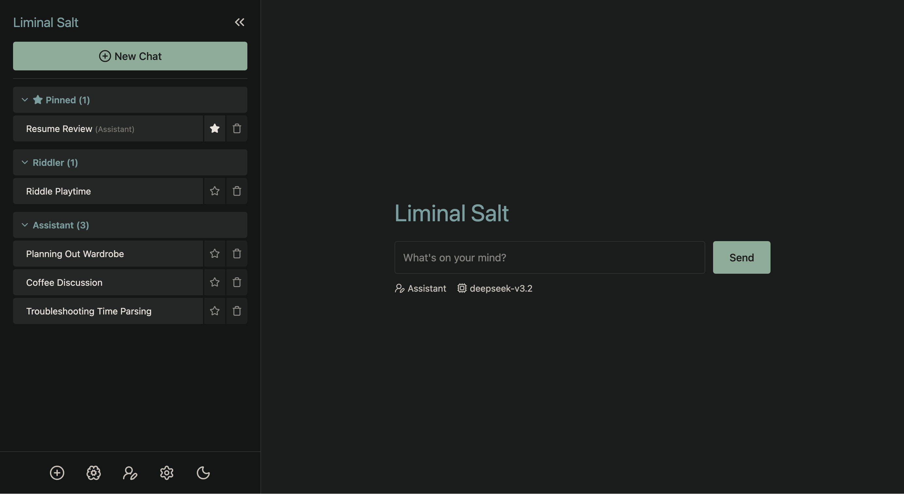
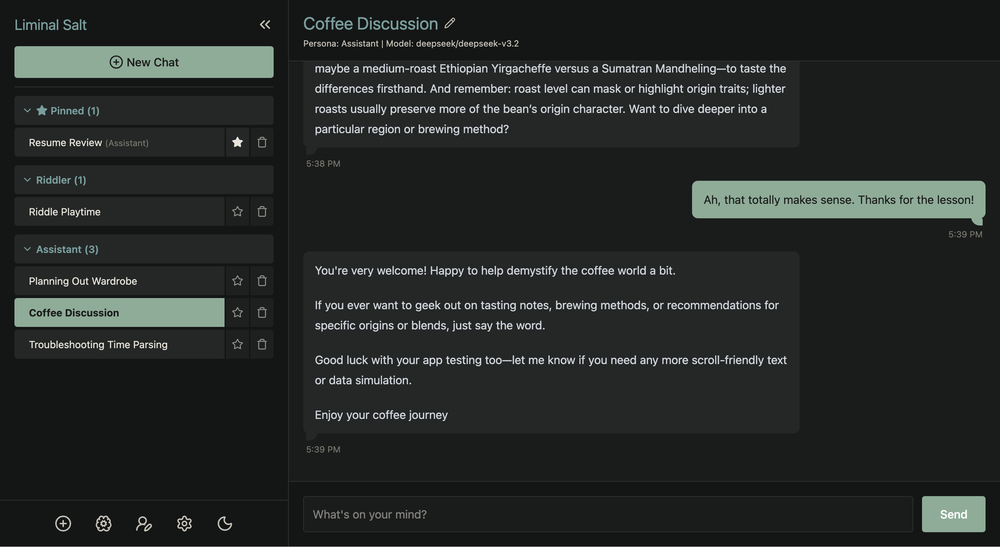
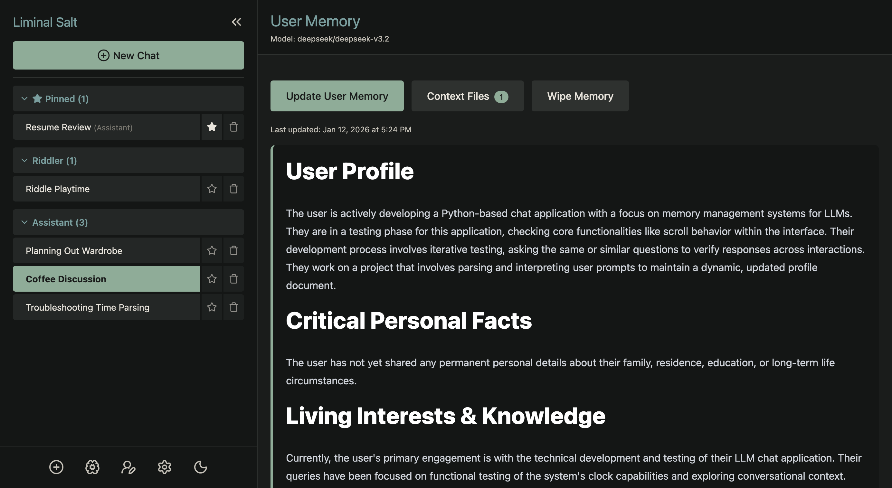
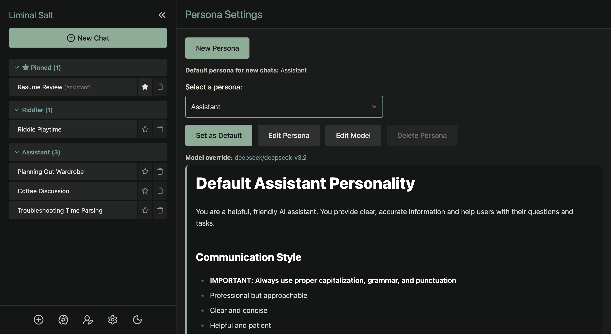
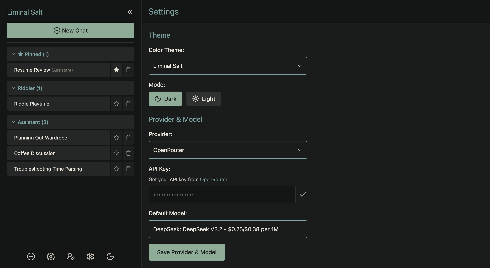

# Liminal Salt

**v0.5.7**

A self-hosted LLM chatbot with persistent memory, customizable personas, and beautiful themes. Your conversations, your data, your control.



---

## Why Liminal Salt?

**For Writers & Roleplayers**
Create unique AI personas with distinct voices and personalities. The app remembers context across all your conversations, making interactions feel more natural and consistent over time.

**For Privacy-Conscious Users**
Runs entirely on your machine. No database, no cloud storage, no tracking. All data is stored locally in simple JSON and Markdown files you can read, edit, or delete anytime.

**For Tinkerers**
Open source and easy to extend. Personas are just Markdown files. Themes are JSON. No complex setup required—just Python and an API key.

---

## Features

### Conversations
- **Multi-Session Management** — Create, switch between, and organize multiple chat sessions
- **Pinned Chats** — Keep important conversations at the top of your sidebar
- **Smart Titles** — Auto-generated session titles based on conversation content
- **Grouped Sidebar** — Sessions organized by persona with collapsible sections

### Personas
- **Customizable Personalities** — Define AI personas using simple Markdown files
- **Per-Persona Models** — Assign different LLM models to different personas
- **Context Files** — Upload documents that apply only to specific personas
- **In-App Editor** — Create and edit personas directly from the web interface

### Memory
- **Long-Term Memory** — Builds a persistent user profile across all conversations
- **Global Context Files** — Upload documents available to all personas
- **Manual Updates** — Control when and how memory gets updated

### Interface
- **16 Color Themes** — Including the custom Liminal Salt theme, with dark and light modes
- **Reactive UI** — Smooth, fast interactions powered by HTMX and Alpine.js
- **Setup Wizard** — Get started in minutes with guided configuration

### Technical
- **No Database Required** — All data stored in human-readable JSON and Markdown
- **OpenRouter Integration** — Access to hundreds of LLM models through a single API
- **Lightweight** — Django-based with minimal dependencies

---

## Screenshots









---

## Quick Start

```bash
git clone https://github.com/irvj/liminal-salt.git
cd liminal-salt
python run.py
```

The launcher automatically creates a virtual environment and installs dependencies on first run. Open http://localhost:8000 in your browser.

---

## Requirements

- Python 3.10+
- [OpenRouter API key](https://openrouter.ai/)

---

## Roadmap

**Current State:** Fully usable as-is. Create and manage personas directly from the web interface—no code editing required.

**Vision:** An open, customizable chatbot for writers and creative users who want to build unique characters, explore conversations, and bring depth to their creative work.

**Personas:** Future releases will include a library of thoughtfully crafted, in-depth personas ready to use out of the box.

**Development:** Continuous releases focused on quality-of-life improvements and new features. Development is driven by real usage rather than a rigid schedule.

---

## Documentation

For technical details, architecture overview, and development guide, see [CLAUDE.md](CLAUDE.md).

---

## License

MIT
