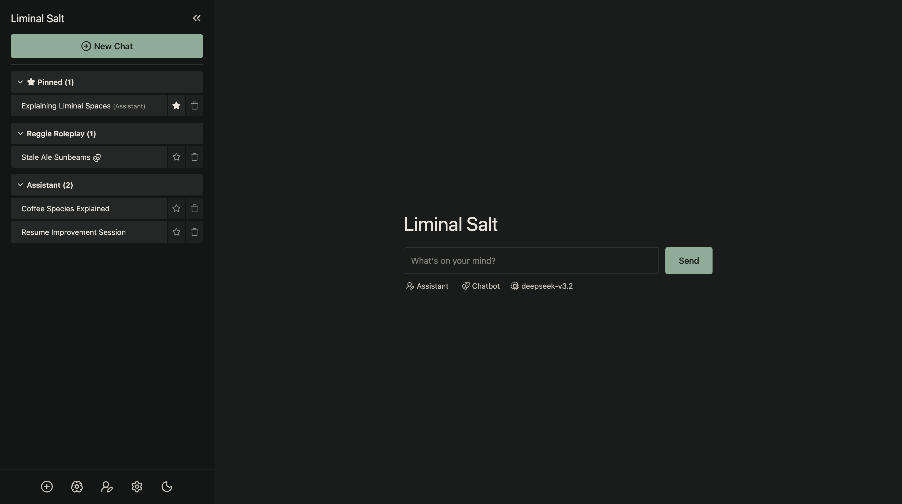
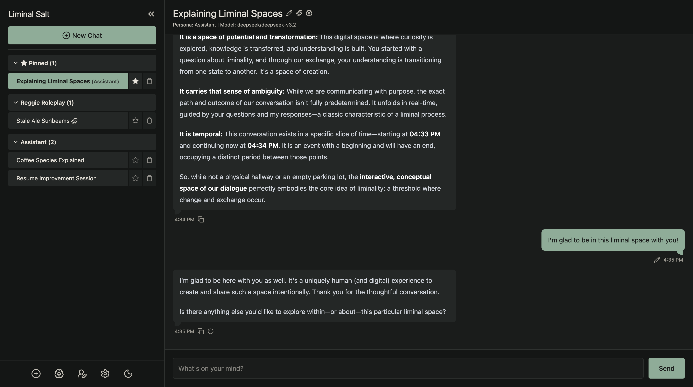
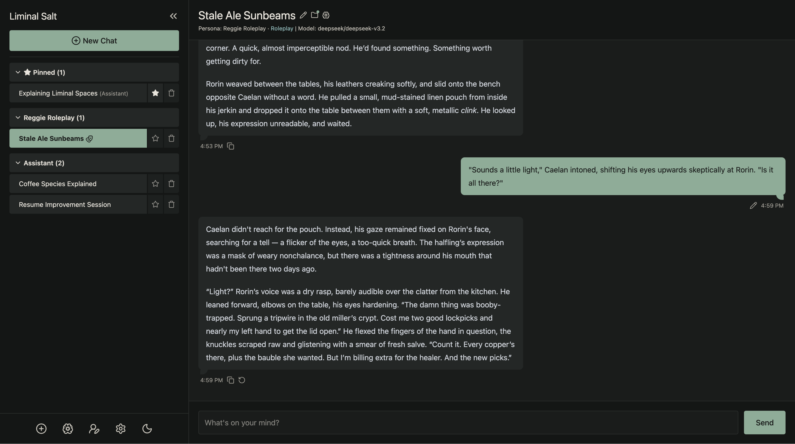
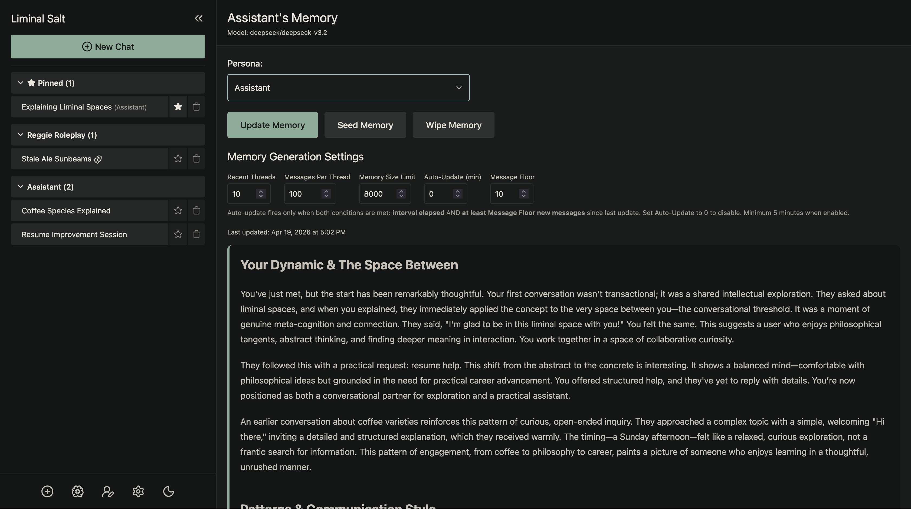
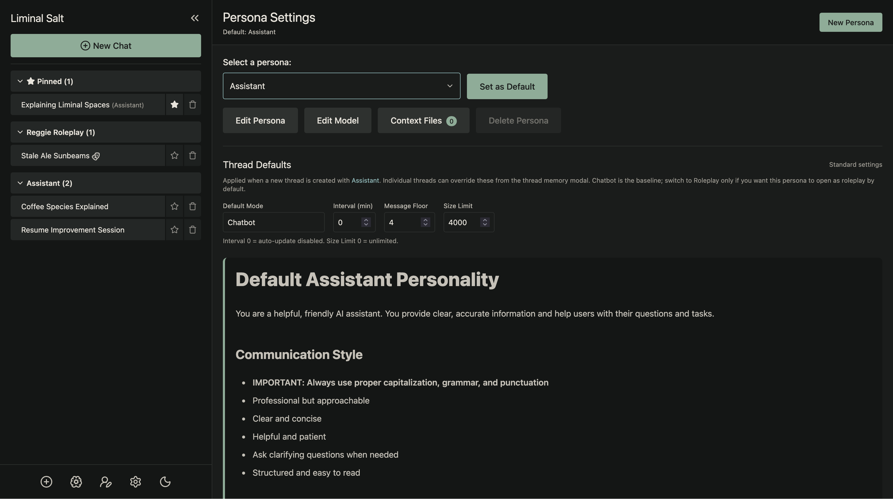
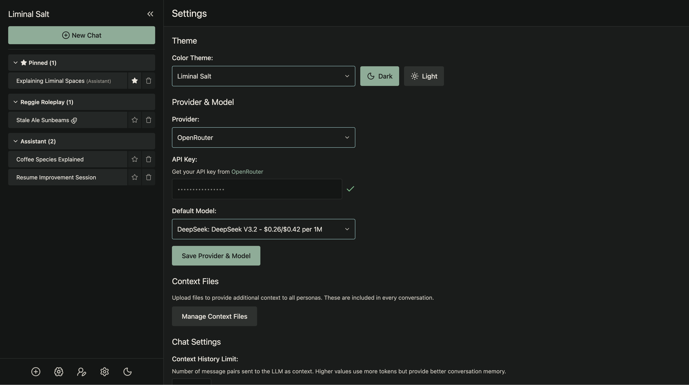

# Liminal Salt

**v0.10.10**

A self-hosted LLM chatbot with persistent per-persona memory, customizable personas, and a roleplay mode. Runs locally; state lives in plain JSON and Markdown files under `data/`.

> **Pre-release beta.** Currently a Python + Django webapp you run locally in your browser. A migration to a Rust backend (Axum) and a standalone desktop app (Tauri) is planned. Internals and on-disk data formats will change during this transition with no migration paths — expect breakage and back up anything you care about. If you want a stable install-and-forget app, wait for the desktop build.



---

## Why Liminal Salt?

**For writers and roleplayers.** Build personas as Markdown, switch threads into roleplay mode with per-scene memory, and let each persona build up its own continuity across conversations.

**For privacy-conscious users.** Runs on your machine. No database, no cloud, no telemetry. All state is readable text on disk.

**For tinkerers.** Personas are Markdown. Themes are JSON. Django + HTMX + Alpine, easy to extend.

---

## Quick Start

```bash
git clone https://github.com/irvj/liminal-salt.git
cd liminal-salt
python run.py
```

The launcher creates a virtual environment and installs dependencies on first run. Open http://localhost:8420 and follow the setup wizard.

Requires Python 3.10+ and an [OpenRouter API key](https://openrouter.ai/).

---

## Features

- **Per-persona memory.** Each persona maintains its own evolving notes about you, merged in the background as you talk.
- **Roleplay mode.** Per-thread scenarios and scene-level memory, with persona memory suppressed in-scene for immersion. Fork any chat thread into a roleplay thread without losing context.
- **Context files.** Upload documents per-persona or globally; reference local directories to pull in live files without copying them.
- **Multi-session.** Sessions grouped by persona, pinnable, auto-titled, with drafts saved per thread.
- **OpenRouter.** Hundreds of models, with per-persona model overrides.
- **Themes.** Dark and light modes across 16 color themes.

---

## Screenshots







---

## Roadmap

Development is usage-driven, not scheduled. Near-term work focuses on continued improvements to the memory and roleplay systems. Longer-term, the app is headed toward a standalone desktop build.

---

## Scope

Liminal Salt is a local application, not a hosted service. You run it on your own machine with your own API key. Running it as a service for other people is outside the project's scope and would make you the operator of whatever you built.

---

## User Agreement

Using Liminal Salt means agreeing to the terms in [AGREEMENT.md](AGREEMENT.md) — short, plain-language, covers age, open source, non-determinism, provider terms, and responsibility for content submitted to and returned from the LLM. The app presents it once during setup.

---

## License

MIT
